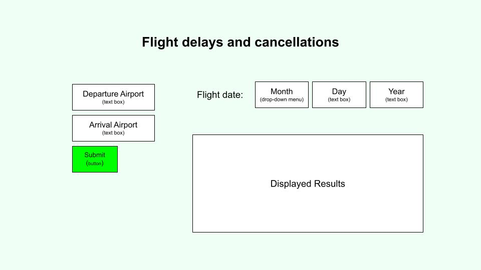

# Flight Delays And Cancellations
## Team 064

## What is stored in the database:

Our database will contain data from a Kaggle dataset sourced from the U.S. DOT Bureau of Transportation Statistics and collects the time performance of domestic U.S. flights by large airlines in 2015. The data contains information about each flight’s airline, departure and destination airports, as well as whether the flight was on-time, delayed, canceled, or diverted.

## Basic Functions:

Users can enter their upcoming travel information (ex: date MM/DD/YYYY, origin/destination airport, etc) and our website will output the airline that will have the estimated least delay time or cancellation information based on flight data from 2015. 
They can also enter in an origin and destination to find the best time of day or year and airline to fly that statistically has the fewest delays/cancellations. Users will also be able to update to our database by providing their recent flight information (date, origin/destination, minutes delayed, etc.). Additionally, we, as admins of the database and website, will be able to delete any entries that we deem to be false information.

## Creative Component:

Our web application will include visualizations of the flight data when users filter it. When users enter their travel information (location, date, time) into our website, our website will display a bar graph representing the estimated delay time for each airline based on the data from 2015. To do this, the backend of our website will query the dataset for flight data filtered based on the user’s travel information, and then create a bar graph based on that data. This will give the users a better understanding of which airline to choose for their upcoming travels to achieve minimum delay.
We would also like to include visualizations for the reason that might cause the delay, the reasons for cancellation of flight for a particular airline/airport to help them choose the best airline or time to visit a particular destination.

## Project Summary:

We are creating the web application using the time performance 2015 data of domestic U.S. flights. The data contains information about each flight’s airline, departure and destination airports, as well as whether the flight was on-time, delayed, canceled, or diverted. We are aiming to provide details to the users about the expected delay time, possible reasons for delay or cancellation and best days to travel to plan their trip accordingly.

## Application:

Give users the information about their flight, information about whether the flight   will be on-time or delayed and the reason for delay or cancellation. Also, suggest a good time to travel based on the least number of delays or cancellation for a particular origin and destination cities. This solves the problem of ambiguity that a passenger might have regarding their flight journey as it depends on the number of factors like weather, airline.

## Usefulness:

Our application is useful because it provides users with a metric of the reliability of each airline given a travel date and destination. There are other similar websites that also aggregate flight data to allow travelers to book flights, such as Expedia. However, those websites focus on displaying the price of each flight to users, whereas ours focuses on helping users determine which flight to take in order to have the least delay time or not to expect any cancellations.

## Realness:

Our data contains information about the flight details of domestic flights in 2015. We will get our data from a Kaggle dataset that is sourced from the U.S. DOT Bureau of Transportation Statistics. The data lists the departure/destination locations, number of minutes delayed, airline name, flight date, and other details about domestic flights in 2015.

# UI Mockup:

## Project work distribution:

Building database from data: Srushti

Backend (querying database, calculating results): Wenyu

Backend (creating visualizations): Annie

Frontend design: Gayathri

